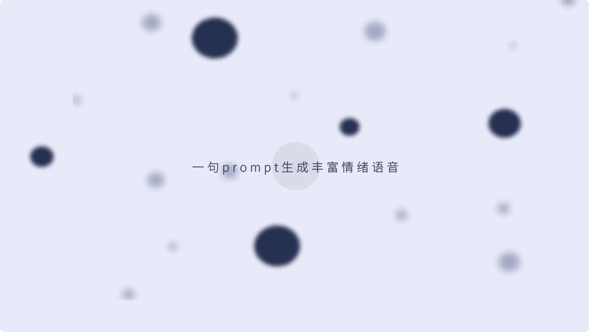

<div align="center">

</div>

<div align="center">
<a href="README2.5_ZH.md" style="font-size: 24px">简体中文</a> | 
<a href="../README2.5.md" style="font-size: 24px">English</a>
</div>

## 👉🏻 IndexTTS 👈🏻

<!-- |**HuggingFace**                                          | **ModelScope** |
|----------------------------------------------------------|----------------------------------------------------------|
|| [IndexTTS-2.5](https://huggingface.co/IndexTeam/IndexTTS-2) | [IndexTTS-2.5](https://modelscope.cn/models/IndexTeam/IndexTTS-2) |
| [IndexTTS-2](https://huggingface.co/IndexTeam/IndexTTS-2) | [IndexTTS-2](https://modelscope.cn/models/IndexTeam/IndexTTS-2) |
| [IndexTTS-1.5](https://huggingface.co/IndexTeam/IndexTTS-1.5) | [IndexTTS-1.5](https://modelscope.cn/models/IndexTeam/IndexTTS-1.5) |
| [IndexTTS](https://huggingface.co/IndexTeam/Index-TTS) | [IndexTTS](https://modelscope.cn/models/IndexTeam/Index-TTS) | -->

| 模型 | 演示 | 论文 | Modelscope | HuggingFace |
| :--- | :---: | :---: | :---: | :---: |
| **IndexTTS-2.5** | [演示](https://index-tts.github.io/index-tts2-5.github.io/) [HF Space](https://huggingface.co/spaces/IndexTeam/IndexTTS-2.5-Demo) | [论文](https://arxiv.org/abs/2601.03888) | [Modelscope](https://modelscope.cn/models/IndexTeam/IndexTTS-2.5) | [HuggingFace](https://huggingface.co/IndexTeam/IndexTTS-2.5) |
| **IndexTTS-2** | [演示](https://index-tts.github.io/index-tts2.github.io/) | [论文](https://arxiv.org/abs/2506.21619) | [Modelscope](https://modelscope.cn/models/IndexTeam/IndexTTS-2) | [HuggingFace](https://huggingface.co/IndexTeam/IndexTTS-2) |
| **IndexTTS-1.5** | [演示](https://index-tts.github.io/) | [论文](https://arxiv.org/abs/2502.05512) | [Modelscope](https://modelscope.cn/models/IndexTeam/IndexTTS-1.5) | [HuggingFace](https://huggingface.co/IndexTeam/IndexTTS-1.5) |
| **IndexTTS** | [演示](https://index-tts.github.io/) | [论文](https://arxiv.org/abs/2502.05512) | [Modelscope](https://modelscope.cn/models/IndexTeam/Index-TTS) | [HuggingFace](https://huggingface.co/IndexTeam/Index-TTS) |

## 📣 更新日志

- `2026/08/10` 🔥 **IndexTTS-2.5** 全球发布！
    - 模型现已支持中文、英文、日语、西班牙语和阿拉伯语，推理速度较IndexTTS-2更快，同时保持跨语言合成与音色-情感解耦能力。
    - 模型提升了中文拼音、英文CMU音素和日语假名的可控性。
- `2025/09/08` 🔥 **IndexTTS-2** 全球发布！
    - 首个支持精确合成时长控制的自回归TTS模型，支持可控与非可控模式。<i>本版本暂未开放该功能。</i>
    - 模型实现高度情感表达的语音合成，支持多模态情感控制。
- `2025/05/14` 🔥 **IndexTTS-1.5** 发布，显著提升模型稳定性及英文表现。
- `2025/03/25` 🔥 **IndexTTS-1.0** 发布，开放模型权重与推理代码。
- `2025/02/12` 🎉 论文提交arXiv，发布演示与测试集。

### 感受IndexTTS

<div align="center">

**IndexTTS2.5：语音未来，现已生成**

[](https://www.bilibili.com/video/BV136a9zqEk5)


**IndexTTS2：语音未来，现已生成**

[](https://www.bilibili.com/video/BV136a9zqEk5)

</div>

## 评测结果

表1：基于CV3-Eval测试集的零样本TTS评测结果（阿拉伯语使用内部测试集）。报告指标：WER (%) ↓ 和说话人相似度 (SS) ↑。†为原始论文引用结果。
| 模型 | 参数量 | test-zh<br>WER (%) ↓ | test-zh<br>SS (%) ↑ | test-en<br>WER (%) ↓ | test-en<br>SS (%) <br> ↑ | test-es<br>WER (%) ↓ | test-es<br>SS (%) ↑ | test-ja<br>WER (%) ↓ | test-ja<br>SS (%) ↑ | test-ar<br>WER (%) ↓ | test-ar<br>SS (%) ↑ | 平均<br>WER (%) <br> ↓ | 平均<br>SS <br> (%) <br> ↑ |
| :--- | :---: | :---: | :---: | :---: | :---: | :---: | :---: | :---: | :---: | :---: | :---: | :---: | :---: |
| VoxCPM2 | 2B | 3.88 | 74.99 | 5.13 | 71.57 | 5.49 | 74.67 | 6.69 | 72.90 | 14.94 | 65.99 | 7.22 | 72.02 |
| OmniVoice | 0.8B | 3.41 | 72.99 | 3.62 | 70.13 | 3.52 | 74.14 | 5.38 | 70.49 | 17.88 | 64.22 | 6.76 | 70.39 |
| Moss-TTS 1.5 | 8B | 4.02 | 72.68 | 4.45 | 67.46 | 3.83 | 71.75 | 10.97 | 68.71 | 23.71 | 62.21 | 9.40 | 68.56 |
| CosyVoice3-0.5B | 0.5B | 3.84 | 80.01 | 4.88 | 74.16 | 4.04 | 78.85 | - | 76.36 | - | - | - | - |
| CosyVoice3-1.5B | 1.5B | 3.91† | - | 4.99† | - | 4.47† | - | 7.57† | - | - | - | - | - |
| FireRedTTS-2 | 1.5B | 8.22 | 68.10 | 14.92 | 56.93 | - | - | - | - | - | - | - | - |
| Fish Audio S2 Pro | 4B | 3.62 | 67.79 | 3.83 | 61.66 | 2.93 | 67.44 | 5.15 | 66.15 | 14.15 | 59.43 | 5.94 | 64.49 |
| Qwen3-TTS | 1.7B | 3.27 | 73.02 | 5.06 | 67.17 | 2.87 | 73.17 | 5.89 | 70.18 | - | - | - | - |
| IndexTTS2.5 | 0.8B | 4.36 | 77.10 | 5.12 | 68.06 | 3.75 | 76.39 | 5.66 | 74.62 | 14.88 | 69.74 | 6.75 | 73.18 |
| IndexTTS2.5-RL | 0.8B | 3.93 | 77.92 | 3.89 | 67.79 | 3.33 | 76.68 | 5.30 | 75.41 | 13.58 | 70.36 | 6.00 | 73.63 |

表2：基于CV3-Eval测试集的跨语言TTS评测（中文提示 → 目标语言，阿拉伯语使用内部测试集）。报告指标：WER (%) ↓ 和说话人相似度 (SS) ↑。
| 模型 | 参数量 | zh→en<br>WER (%) ↓ | zh→en<br>SS (%) ↑ | zh→es<br>WER (%) ↓ | zh→es<br>SS (%) ↑ | zh→ja<br>WER (%) ↓ | zh→ja<br>SS (%) ↑ | zh→ar<br>WER (%) ↓ | zh→ar<br>SS (%) ↑ | 平均<br>WER (%) ↓ | 平均<br>SS <br> (%) ↑ |
| :--- | :---: | :---: | :---: | :---: | :---: | :---: | :---: | :---: | :---: | :---: | :---: |
| VoxCPM2 | 2B | 4.48 | 64.25 | 16.38 | 64.89 | 11.84 | 71.54 | 11.09 | 67.62 | 10.95 | 67.08 |
| OmniVoice | 0.8B | 3.74 | 64.91 | 5.84 | 62.08 | 9.09 | 69.06 | 19.80 | 65.27 | 9.62 | 65.33 |
| Moss-TTS 1.5 | 8B | 6.13 | 59.23 | 4.32 | 56.63 | 11.52 | 65.54 | 17.03 | 62.93 | 9.75 | 61.08 |
| CosyVoice3-0.5B | 0.5B | 3.23 | 62.79 | 4.58 | 64.04 | - | - | - | - | - | - |
| CosyVoice3-1.5B | 1.5B | 4.32 | - | - | - | 13.70 | - | - | - | - | - |
| FireRedTTS-2 | 1.5B | 9.34 | 53.19 | 12.25 | 58.31 | 19.05 | 64.12 | - | - | - | - |
| Fish Audio S2 Pro | 4B | 4.14 | 55.89 | 4.46 | 55.57 | 10.48 | 61.74 | 14.49 | 59.80 | 8.39 | 58.25 |
| Qwen3-TTS | 1.7B | 5.74 | 63.04 | 5.15 | 68.02 | 36.09 | 65.71 | - | - | - | - |
| IndexTTS2.5 | 0.8B | 3.62 | 63.83 | 5.17 | 65.48 | 6.57 | 74.16 | 9.51 | 71.02 | 6.22 | 68.62 |
| IndexTTS2.5-RL | 0.8B | 3.55 | 67.47 | 4.86 | 64.47 | 6.38 | 75.82 | 9.89 | 73.05 | 6.17 | 70.20 |


### 联系方式

QQ群：663272642(4群) 1013410623(5群)  \
Discord：https://discord.gg/uT32E7KDmy  \
邮箱：indexspeech@bilibili.com  \
欢迎加入我们的社区！🌏  \
欢迎大家交流讨论！

> [!CAUTION]
> 感谢大家对bilibili indextts项目的支持与关注！
> 请注意，目前由核心团队直接维护的**官方渠道仅有**: [https://github.com/index-tts/index-tts](https://github.com/index-tts/index-tts).
> ***其他任何网站或服务均非官方提供***，我们对其内容及安全性、准确性和及时性不作任何担保。
> 为了保障您的权益，建议通过上述官方渠道获取bilibili indextts项目的最新进展与更新。

**Tips:** 如需更多信息请联系作者。商业合作请联系 <u>indexspeech@bilibili.com</u>。

## 使用说明

### ⚙️ 环境配置

1. 请确保已安装 [git](https://git-scm.com/downloads) 和 [git-lfs](https://git-lfs.com/)。

在仓库中启用Git-LFS：

```bash
git lfs install
```

2. 下载代码：

```bash
git clone https://github.com/index-tts/index-tts.git && cd index-tts
git lfs pull  # 下载大文件
```

3. 安装 [uv 包管理器](https://docs.astral.sh/uv/getting-started/installation/)。
   *必须*使用uv保证依赖环境可靠。

> [!TIP]
> **快速安装方法：**
> 
> uv安装方式多样，详见官网。也可快速安装：
> 
> ```bash
> pip install -U uv
> ```

> [!WARNING]
> 本文档**仅**支持uv安装方式。其他工具如 `conda` 或 `pip` 无法保证依赖版本正确，
> 可能导致*偶发bug、报错、**GPU加速失效**以及各种其他问题*。
> 如使用非标准安装方式，请*不要提交issue*，此类问题通常无效。
> 
> 此外，uv比pip快 [115倍](https://github.com/astral-sh/uv/blob/main/BENCHMARKS.md)，
> 是Python项目管理的新标准，强烈推荐。

4. 安装依赖：

使用 `uv` 管理项目依赖。以下命令会*自动*创建 `.venv` 虚拟环境并安装正确版本的Python及所有依赖：

```bash
uv sync --all-extras
```

如中国大陆地区用户下载缓慢，可选用国内镜像：

```bash
uv sync --all-extras --default-index "https://mirrors.aliyun.com/pypi/simple"

uv sync --all-extras --default-index "https://mirrors.tuna.tsinghua.edu.cn/pypi/web/simple"
```

> [!TIP]
> **可选功能：**
> 
> - `--all-extras`：安装全部可选功能。可去除此选项自定义安装。
> - `--extra webui`：安装WebUI支持（推荐）。
> - `--extra deepspeed`：安装DeepSpeed加速（部分环境可加速推理）。

> [!IMPORTANT]
> **Windows注意：** DeepSpeed在部分Windows环境较难安装，可去除 `--all-extras`，
> 手动添加所需的其他功能选项。
> 
> **Linux/Windows注意：** 如遇CUDA相关报错，请确保已安装NVIDIA [CUDA Toolkit](https://developer.nvidia.com/cuda-toolkit) 12.8及以上版本。

5. 下载模型（通过 [uv tool](https://docs.astral.sh/uv/guides/tools/#installing-tools)）：

HuggingFace下载：

```bash
uv tool install "huggingface-hub"

hf download IndexTeam/IndexTTS-2 --local-dir=checkpoints
hf download IndexTeam/IndexTTS-2.5 --local-dir=checkpoints
```

ModelScope下载：

```bash
uv tool install "modelscope"

modelscope download --model IndexTeam/IndexTTS-2 --local_dir checkpoints
modelscope download --model IndexTeam/IndexTTS-2.5 --local_dir checkpoints
```

> [!IMPORTANT]
> 如上述命令无法运行，请仔细阅读 `uv tool` 输出信息，按提示将工具添加到系统PATH。

> [!NOTE]
> 项目首次运行还会自动下载部分小模型。如网络访问HuggingFace较慢，建议提前设置镜像：
> 
> ```bash
> export HF_ENDPOINT="https://hf-mirror.com"
> ```


#### 🖥️ PyTorch GPU 加速检测

如需检测系统GPU状态，可运行以下脚本：

```bash
uv run tools/gpu_check.py
```


### 🔥 快速体验

#### 🌐 Web演示

```bash
# IndexTTS2（默认）
uv run webui.py

# IndexTTS2.5
uv run webui.py --version 2.5 --model_dir ./checkpoints_25
```

浏览器访问 `http://127.0.0.1:7860` 查看演示。

可通过命令行参数开启BF16（IndexTTS 2.5）/FP16（IndexTTS 2）推理（降低显存占用）、DeepSpeed加速、CUDA内核编译加速等。
运行以下命令查看所有可用选项：

```bash
uv run webui.py -h
```

祝使用愉快！

> [!IMPORTANT]
> 使用 **FP16/BF16**（半精度）推理非常有益，推理更快且显存占用更低，质量损失极小。
> 
> **DeepSpeed** *可能*在部分系统上加速推理，但也可能变慢，效果取决于具体硬件、驱动及操作系统。
> 建议分别开启和关闭测试，找到最适合自己环境的配置。
> 
> 注意：所有 `uv` 命令会**自动激活**对应项目的虚拟环境。请*不要*手动激活环境后再运行 `uv` 命令，
> 否则可能导致依赖冲突！


#### 📝 Python脚本调用

运行脚本时请使用 `uv run <file.py>` 保证程序在uv创建的虚拟环境下运行。
部分情况可能需要将当前目录加入 `PYTHONPATH`。

示例：

```bash
# IndexTTS2
PYTHONPATH="$PYTHONPATH:." uv run indextts/infer_v2.py

# IndexTTS2.5
PYTHONPATH="$PYTHONPATH:." uv run indextts/infer_v2_5.py \
  --cfg_path checkpoints/config_v2_5.yaml \
  --model_dir checkpoints \
  --text "Hello world" \
  --lang EN
```

以下为脚本调用示例：

0. 初始化IndexTTS
```python
# IndexTTS2
from indextts.infer_v2 import IndexTTS2
tts = IndexTTS2(cfg_path="checkpoints/config.yaml", model_dir="checkpoints", use_fp16=False, use_cuda_kernel=False, use_deepspeed=False)

# IndexTTS2.5
from indextts.infer_v2_5 import IndexTTS2
tts = IndexTTS2(cfg_path="checkpoints_25/config_v2_5.yaml", model_dir="checkpoints_25", use_bf16=True)
```
1. 单一参考音频（音色克隆）：

```python
text = "Translate for me, what is a surprise!"

# IndexTTS2
tts.infer(spk_audio_prompt='examples/voice_01.wav', text=text, output_path="gen.wav", verbose=True)

# IndexTTS2.5（多语言，需指定语言）
tts.infer(spk_audio_prompt='examples/voice_01.wav', text=text, lang="EN", output_path="gen.wav", verbose=True)
```

2. 使用独立的情感参考音频来控制语音合成的情感：

```python
text = "酒楼丧尽天良，开始借机竞拍房间，哎，一群蠢货。"

# IndexTTS2
tts.infer(spk_audio_prompt='examples/voice_07.wav', text=text, output_path="gen.wav", emo_audio_prompt="examples/emo_sad.wav", verbose=True)

# IndexTTS2.5
tts.infer(spk_audio_prompt='examples/voice_07.wav', text=text, lang="ZH", output_path="gen.wav", emo_audio_prompt="examples/emo_sad.wav", verbose=True)

```

3. 指定情感参考音频时，可通过 `emo_alpha` 调节情感影响强度。
   有效范围 `0.0 - 1.0`，默认值为 `1.0`（100%）：

```python
text = "酒楼丧尽天良，开始借机竞拍房间，哎，一群蠢货。"

# IndexTTS2
tts.infer(spk_audio_prompt='examples/voice_07.wav', text=text, output_path="gen.wav", emo_audio_prompt="examples/emo_sad.wav", emo_alpha=0.9, verbose=True)

# IndexTTS2.5
tts.infer(spk_audio_prompt='examples/voice_07.wav', text=text, output_path="gen.wav", lang="ZH", emo_audio_prompt="examples/emo_sad.wav", emo_alpha=0.9, verbose=True)
```

4. 也可以不使用情感参考音频，直接提供8维情感向量，按以下顺序指定各情感强度：
   `[高兴, 愤怒, 悲伤, 害怕, 厌恶, 忧郁, 惊讶, 平静]`。
   可使用 `use_random` 参数开启推理随机性；默认值为 `False`，设为 `True` 开启随机采样：

> [!NOTE]
> 开启随机采样会降低音色克隆的还原度。

```python
text = "对不起嘛！我的记性真的不太好，但是和你在一起的事情，我都会努力记住的~"

# IndexTTS2
tts.infer(spk_audio_prompt='examples/voice_09.wav', text=text, output_path="gen.wav", emo_vector=[0, 0, 0.8, 0, 0, 0, 0, 0], use_random=False, verbose=True)

# IndexTTS2.5
tts.infer(spk_audio_prompt='examples/voice_09.wav', text=text, lang="ZH", output_path="gen.wav", emo_vector=[0, 0, 0.8, 0, 0, 0, 0, 0], use_random=False, verbose=True)
```

5. 可开启 `use_emo_text` 根据输入文本自动生成情感向量。
   建议在文本情感模式下将 `emo_alpha` 设为0.6左右（或更低），以获得更自然的语音效果。
   可使用 `use_random` 开启随机性（默认 `False`，`True` 开启随机采样）：

```python
text = "快躲起来！是他要来了！他要来抓我们了！"

# IndexTTS2
tts.infer(spk_audio_prompt='examples/voice_12.wav', text=text, output_path="gen.wav", emo_alpha=0.6, use_emo_text=True, use_random=False, verbose=True)

# IndexTTS2.5
tts.infer(spk_audio_prompt='examples/voice_12.wav', text=text, lang="ZH", output_path="gen.wav", emo_alpha=0.6, use_emo_text=True, use_random=False, verbose=True)
```

6. 也可以通过 `emo_text` 参数直接提供情感描述文本，情感文本会自动转换为情感向量。
   这允许文本内容与情感描述分别控制：

```python
text = "快躲起来！是他要来了！他要来抓我们了！"
emo_text = "你吓死我了！你是鬼吗？"

# IndexTTS2
tts.infer(spk_audio_prompt='examples/voice_12.wav', text=text, output_path="gen.wav", emo_alpha=0.6, use_emo_text=True, emo_text=emo_text, use_random=False, verbose=True)

# IndexTTS2.5
tts.infer(spk_audio_prompt='examples/voice_12.wav', text=text, lang="ZH", output_path="gen.wav", emo_alpha=0.6, use_emo_text=True, emo_text=emo_text, use_random=False, verbose=True)
```

7. 通过 `duration_factor` 参数可以控制生成语音的语速。
   大于 `1.0` 语速变慢，小于 `1.0` 语速变快，默认值为 `1.0`（正常语速）。
   有效范围 `0.5 - 2.0`：

```python
text = "大家好，欢迎来到IndexTTS的语速控制演示。"

# 语速变慢（1.2倍时长）
tts.infer(spk_audio_prompt='examples/voice_01.wav', text=text, lang="ZH", output_path="gen_slow.wav", duration_factor=1.2, verbose=True)

# 语速变快（0.8倍时长）
tts.infer(spk_audio_prompt='examples/voice_01.wav', text=text, lang="ZH", output_path="gen_fast.wav", duration_factor=0.8, verbose=True)
```

> [!TIP]
>
> **IndexTTS2.5 拼音/英文音素/日语假名使用说明：**
> 
> IndexTTS2.5 现已支持以下字符替换功能，具有更好的指令跟随能力。
> 完整合法拼音列表请参考 `checkpoints/pinyin.vocab`；CMU音素词典请参考 'https://svn.code.sf.net/p/cmusphinx/code/trunk/cmudict/cmudict-0.7b'。
>
> 示例：
> ```
> 他在银<行|XING2>里<行|HANG2>走了半天，发现这笔业务办不<行|HANG2>。
>
> He had a <minute|M IH1 . N AH0 T> to examine the <minute|M AY0 . N UW1 T> details of the contract.
>
> 彼は料理が<上手|じょうず>だが、囲碁では<上手|うわて>に負けた。
> ```
> **IndexTTS2 拼音使用说明：**
> 
> IndexTTS2依然支持中文字符与拼音混合建模。
> 在使用时，如需精确的发音控制，请输入包含特定拼音标注的文本来触发拼音控制功能。
> 需要注意的是：拼音控制并不是对所有声母韵母组合都生效，系统仅支持中文合法拼音。
> 具体合法情况可参考项目中的 `checkpoints/pinyin.vocab` 文件。
>
> 示例：
> ```
> 之前你做DE5很好，所以这一次也DEI3做DE2很好才XING2，如果这次目标完成得不错的话，我们就直接打DI1去银行取钱。
> ```
> **旧版IndexTTS1使用说明：**
>
> 如需使用旧的IndexTTS1模型，可以import旧模块：
>
>```python
>from indextts.infer import IndexTTS
>tts = IndexTTS(model_dir="checkpoints",cfg_path="checkpoints/config.yaml")
>voice = "examples/voice_07.wav"
>text = "大家好，我现在正在bilibili 体验 ai 科技，说实话，来之前我绝对想不到！AI技术已经发展到这样匪夷所思的地步了！比如说，现在正在说话的其实是B站为我现场复刻的数字分身，简直就是平行宇宙的另一个我了。如果大家也想体验更多深入的AIGC功能，可以访问 bilibili studio，相信我，你们也会吃惊的。"
>tts.infer(voice, text, 'gen.wav')
>```
>
>详细信息见 [README_INDEXTTS_1_5](../archive/README_INDEXTTS_1_5.md)，
或访问IndexTTS1仓库 <a href="https://github.com/index-tts/index-tts/tree/v1.5.0">index-tts:v1.5.0</a>。


## 致谢

1. [tortoise-tts](https://github.com/neonbjb/tortoise-tts)
2. [XTTSv2](https://github.com/coqui-ai/TTS)
3. [BigVGAN](https://github.com/NVIDIA/BigVGAN)
4. [wenet](https://github.com/wenet-e2e/wenet/tree/main)
5. [icefall](https://github.com/k2-fsa/icefall)
6. [maskgct](https://github.com/open-mmlab/Amphion/tree/main/models/tts/maskgct)
7. [seed-vc](https://github.com/Plachtaa/seed-vc)

## 📚 论文引用

🌟 如果本项目对您有帮助，请为我们点star并引用论文。

IndexTTS2.5:

```
@misc{li2026indextts25technicalreport,
      title={IndexTTS 2.5 Technical Report}, 
      author={Yunpei Li and Xun Zhou and Jinchao Wang and Lu Wang and Yong Wu and Siyi Zhou and Yiquan Zhou and Yining Wang and Yaogen Yang and Zhetao Hu and Shiyao Duan and Jiacheng Xu and Bin Xia and Jingchen Shu},
      year={2026},
      eprint={2601.03888},
      archivePrefix={arXiv},
      primaryClass={cs.SD},
      url={https://arxiv.org/abs/2601.03888}, 
}
```

IndexTTS2:

```
@article{zhou2025indextts2,
  title={IndexTTS2: A Breakthrough in Emotionally Expressive and Duration-Controlled Auto-Regressive Zero-Shot Text-to-Speech},
  author={Siyi Zhou, Yiquan Zhou, Yi He, Xun Zhou, Jinchao Wang, Wei Deng, Jingchen Shu},
  journal={arXiv preprint arXiv:2506.21619},
  year={2025}
}
```


IndexTTS:

```
@article{deng2025indextts,
  title={IndexTTS: An Industrial-Level Controllable and Efficient Zero-Shot Text-To-Speech System},
  author={Wei Deng, Siyi Zhou, Jingchen Shu, Jinchao Wang, Lu Wang},
  journal={arXiv preprint arXiv:2502.05512},
  year={2025},
  doi={10.48550/arXiv.2502.05512},
  url={https://arxiv.org/abs/2502.05512}
}
```
